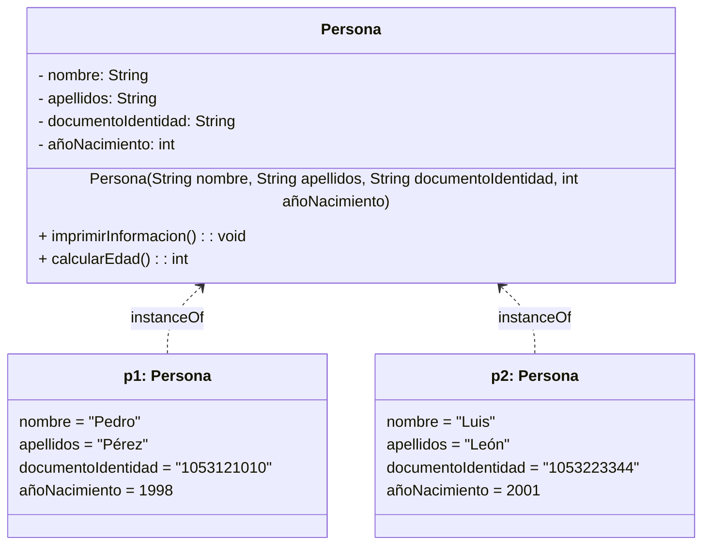

# Ejercicio Persona - Jean Paul Rojas Herrera

## Diagrama de clases (Mermaid)

```mermaid
classDiagram
    class Persona {
        - nombre: String
        - apellidos: String 
        - documentoIdentidad: String 
        - añoNacimiento: int 
        Persona(String nombre, String apellidos, String documentoIdentidad, int añoNacimiento)
        + imprimirInformacion(): void
        + calcularEdad(): int
    }

    class p1["p1: Persona"] {
        nombre = "Pedro"
        apellidos = "Pérez"
        documentoIdentidad = "1053121010"
        añoNacimiento = 1998
    }

    class p2["p2: Persona"] {
        nombre = "Luis"
        apellidos = "León"
        documentoIdentidad = "1053223344"
        añoNacimiento = 2001
    }

    Persona <.. p1 : instanceOf
    Persona <.. p2 : instanceOf
```